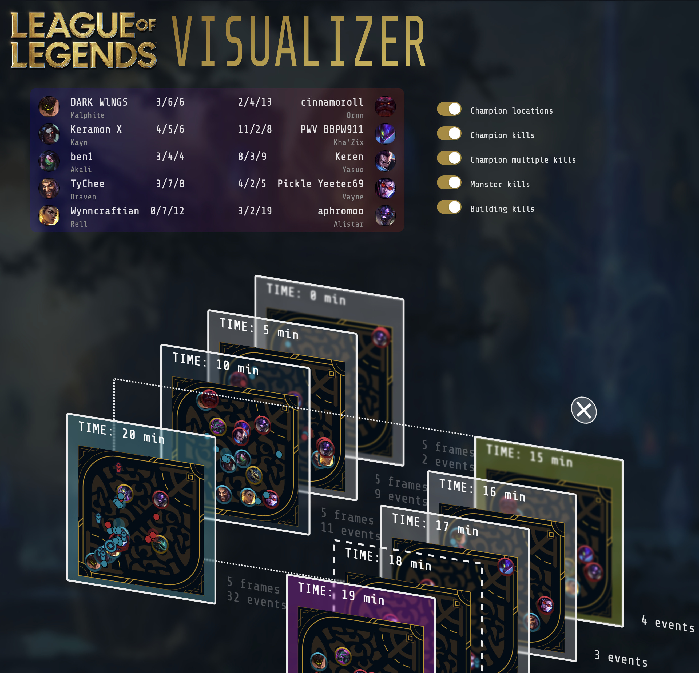

# MIS 588 Data Visualization

This repository serves the in-class assignments of MIS 588, which use [D3.js](https://d3js.org).

## Final project: LoL Visualizer
[LoL-Viz](https://ernestchu.github.io/lol-viz/): Top summoner's statistics and visualizations
in Challenger League!
  


## Examples

- [PA1](PA1/)
- [PA2](PA2/)
- [PA3](PA3/)
- [PA4](PA4/)
- [PA5](PA5/)
- [PA6](PA6/)

## Local development

### Start http server, you'll need it for D3.js to load local csv files.

```
npx serve
```

### Lint the code

```
npx prettier --write .
```
